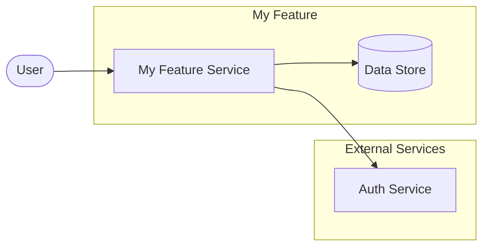

# High-Level Design (HLD)

This folder contains auto-generated High-Level Design documents.

One `*-hld.md` file is created or updated for each requirement Markdown file
that changes in a merged pull request. For example:

- `doc/requirements/payment-flow.md` → `doc/hld/payment-flow-hld.md`
- `doc/requirements/user-authentication.md` → `doc/hld/user-authentication-hld.md`

Files are generated automatically by the **HLD Generator** workflow
(`.github/workflows/hld-generator.yml`) whenever a pull request that changes
`doc/requirements/` is merged into `main`.

## HLD document structure

Each generated HLD file contains the following sections:

| Section | Description |
|---------|-------------|
| **Overview** | A short summary extracted from the requirement file |
| **Solution Architecture Diagram** | A fenced Mermaid `flowchart LR` block showing actors, services, data stores, and external integrations derived from the requirement content |
| **Components** | Table of main components/services (placeholder for developer or agent to complete) |
| **Assumptions** | Assumptions extracted from the requirement file |
| **Open Questions** | Placeholder for open decisions |

### Example diagram

Do **not** edit `*-hld.md` files by hand — your changes will be overwritten on
the next automated run. To update an HLD, update the corresponding source
requirement file in `doc/requirements/` instead.
