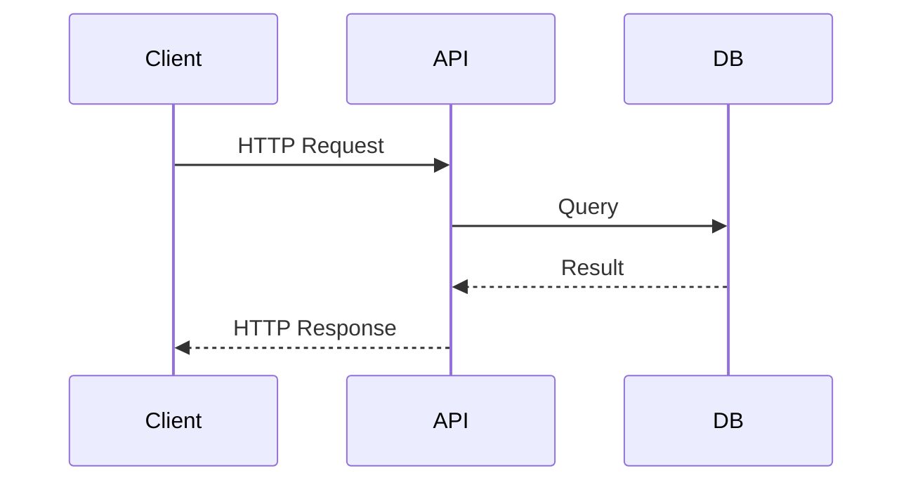

# High-Level Design: shopping-cart-system

> **Auto-generated** from `doc/requirements/shopping-cart-system.md`
> triggered by PR #10: *Fix typo in functional requirement FR-1*
>
> Generated: 2026-06-21T15:55:40Z

---

## Table of Contents

1. [System Overview](#system-overview)
2. [shopping-cart-system](#shopping-cart-system)
3. [Components](#components)
4. [Data and Control Flow](#data-and-control-flow)
5. [Assumptions](#assumptions)
6. [Open Questions](#open-questions)

---

## System Overview

<!-- TODO: provide a concise summary of the overall system.
     A cloud agent or developer should replace this section with a
     narrative derived from the source Markdown file listed below. -->

---

## shopping-cart-system

<!-- Source: doc/requirements/shopping-cart-system.md -->

# Shopping Cart System

## Overview
This document describes a dummy shopping cart system for an e-commerce site.

## Functional requirements
- FR-1: Users can add products to the cart. 
- FR-2: Users can update item quantities in the cart.
- FR-3: Users can remove items from the cart.
- FR-4: Users can view the cart summary before checkout.
- FR-5: The system can calculate subtotal, discounts, tax, and total.

## Non-functional requirements
- NFR-1: Cart updates should appear immediately after each user action.
- NFR-2: Cart state should persist for returning users during the same session.
- NFR-3: The cart page should remain usable on desktop and mobile devices.

## Assumptions
- Product catalog data is already available to the shopping cart service.
- Pricing and discount rules are provided by upstream business logic.

## Out of scope
- Payment processing.
- Order fulfillment.
- Inventory management.

---

## Components

<!-- TODO: list the main components or services identified in the
     source document above, e.g.:

| Component | Responsibility | Technology |
|-----------|---------------|------------|
| API       | REST endpoint  | Spring Boot|
-->

---

## Data and Control Flow

<!-- TODO: describe or diagram the data and control flow.
     Example Mermaid sequence diagram:

-->

---

## Assumptions

<!-- TODO: list assumptions, e.g.:
- The API is stateless.
- Authentication is handled externally.
-->

---

## Open Questions

<!-- TODO: list open questions or decisions still needed. -->
