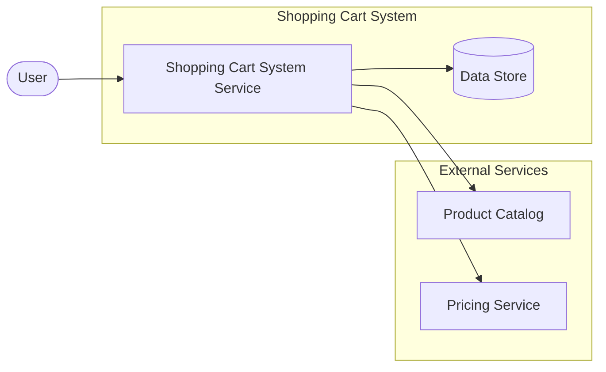

# High-Level Design: shopping-cart-system

> **Auto-generated** from `doc/requirements/shopping-cart-system.md`
> triggered by PR #31: *Add user authentication to out of scope section*
>
> Generated: 2026-06-21T22:34:42Z

---

## Overview

This document describes a dummy shopping cart system for an e-commerce site.

---

## Solution Architecture Diagram

---

## Components

| Component | Responsibility | Technology |
|-----------|----------------|------------|
| <!-- TODO: fill in components --> | | |

---

## Assumptions

- Product catalog data is already available to the shopping cart service.
- Pricing and discount rules are provided by upstream business logic.

---

## Open Questions

<!-- TODO: list open questions or decisions still needed. -->
