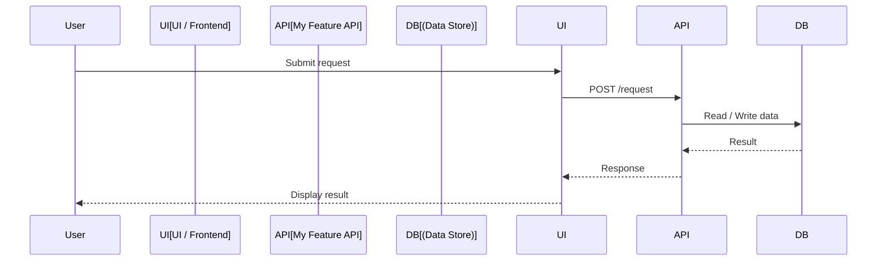
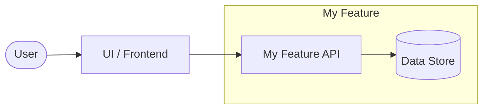

# Low-Level Design (LLD)

This folder contains auto-generated Low-Level Design documents.

One `*-lld.md` file is created or updated for each HLD Markdown file
that changes in a merged pull request. For example:

- `doc/hld/payment-flow-hld.md` → `doc/lld/payment-flow-lld.md`
- `doc/hld/user-authentication-hld.md` → `doc/lld/user-authentication-lld.md`

Files are generated automatically by the **LLD Generator** workflow
(`.github/workflows/lld-generator.yml`) whenever a pull request that changes
`doc/hld/*-hld.md` files is merged into `main`.

## LLD document structure

Each generated LLD file contains the following sections:

| Section | Description |
|---------|-------------|
| **Overview** | A short summary extracted from the HLD file |
| **Sequence Diagram** | A fenced Mermaid `sequenceDiagram` block showing interactions between participants derived from the HLD content |
| **Flow Diagram** | A fenced Mermaid `flowchart LR` block showing the data and control flow derived from the HLD content |
| **Components / Modules** | Table of main components/modules (placeholder for developer or agent to complete) |
| **Assumptions** | Assumptions extracted from the HLD file |
| **Open Questions** | Placeholder for open decisions |

### Example Sequence Diagram

### Example Flow Diagram

Do **not** edit `*-lld.md` files by hand — your changes will be overwritten on
the next automated run. To update an LLD, update the corresponding source HLD
file in `doc/hld/` instead.
