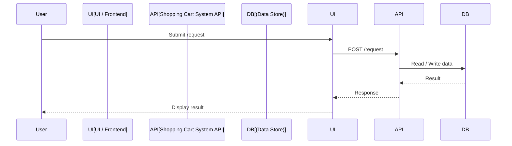
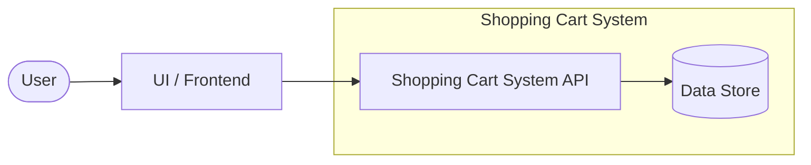

# Low-Level Design: Shopping Cart System

> **Auto-generated** from `doc/hld/shopping-cart-system-hld.md`
> triggered by commit `2b08a31749fee8d57ed0e662cc040a8e20f24f6c` (push to main)
>
> Generated: 2026-06-21T20:15:17Z

---

## Overview

This document describes a dummy shopping cart system for an e-commerce site.

---

## Sequence Diagram

---

## Flow Diagram

---

## Components / Modules

| Component | Responsibility | Technology |
|-----------|----------------|------------|
| <!-- TODO: fill in components --> | | |

---

## Assumptions

- Product catalog data is already available to the shopping cart service.
- Pricing and discount rules are provided by upstream business logic.

---

## Open Questions

<!-- TODO: list open questions or decisions still needed. -->
