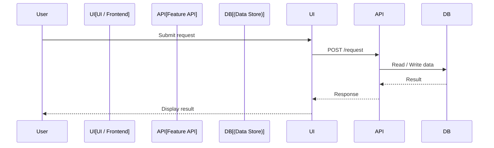
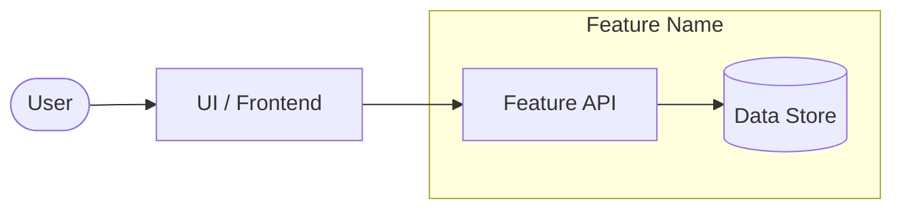

# LLD Generator — Agent Prompt Template

Use this template as the starting point for a cloud agent session whenever you
want to manually trigger (or re-trigger) LLD generation from a specific merged
pull request.

---

## Reusable Prompt Template

Copy the block below, fill in the placeholders, and paste it into your cloud
agent (e.g. GitHub Copilot Coding Agent in IntelliJ or the web UI).

```
Inspect repository `<owner/repo>` on branch `<target-branch>`.

Task:
1. Find the most recently merged pull request into `<target-branch>` (or PR #<pr-number> if known).
2. Check whether the folder `<hld-folder>` was changed in that PR.
3. If the folder changed, identify all `*-hld.md` files inside `<hld-folder>` that were
   changed in the PR.
4. For each changed HLD file, extract the architecture, components, data/control flow,
   participants, and key behaviours described in that Markdown file.
5. Generate (or update) one LLD file per changed HLD file at
   `<lld-output-dir>/<basename>-lld.md`, where `<basename>` is the HLD filename
   without the `-hld.md` suffix. For example:
   - `<hld-folder>/payment-flow-hld.md` → `<lld-output-dir>/payment-flow-lld.md`
   - `<hld-folder>/user-authentication-hld.md` → `<lld-output-dir>/user-authentication-lld.md`
   Each LLD must include:
   - Overview (extracted from the HLD)
   - Sequence Diagram (fenced Mermaid `sequenceDiagram` showing interactions between
     participants: User, UI/Frontend, API, Auth Service, Data Store, etc.)
   - Flow Diagram (fenced Mermaid `flowchart LR` or `flowchart TB` showing data and
     control flow; use subgraphs to group the core system and external services)
   - Components / Modules (table of main components/modules)
   - Assumptions (extracted from the HLD)
   - Open Questions
6. If no relevant HLD files are found in the folder, report that clearly and stop.
7. If the folder was not changed in the latest merged PR, report that clearly and stop.
8. Do not modify any application source code or unrelated files.
9. Open a pull request with the generated LLD files if any were created or updated.
```

---

## Placeholder Reference

| Placeholder          | Example value               | Description                              |
|----------------------|-----------------------------|------------------------------------------|
| `<owner/repo>`       | `sumncc/CopilotDemo`        | GitHub repository in `owner/repo` format |
| `<target-branch>`    | `main`                      | Branch that receives merged PRs          |
| `<pr-number>`        | `42`                        | Optional — pin to a specific PR          |
| `<hld-folder>`       | `doc/hld`                   | Folder to watch for HLD changes          |
| `<lld-output-dir>`   | `doc/lld`                   | Directory where LLD files are written    |

---

## Optional Additions

Append any of these lines to the prompt above when needed:

- `"Use subgraphs to clearly separate the core system and external integrations."`
- `"Keep the LLD concise — one page if possible."`
- `"Follow the existing documentation style in the repository."`

---

## How the Automation Works

```
PR merged into <target-branch>
        │
        ▼
GitHub Actions: lld-generator.yml
        │
        ├─ Did <hld-folder> change? ──No──► Stop (no-op)
        │
        └─ Yes
              │
              ├─ Find *-hld.md files changed in the PR
              │       │
              │       └─ None found? ──► Warning, stop
              │
              └─ Run .github/scripts/generate-lld.sh
                        │
                        └─ For each changed HLD file:
                                  │
                                  ├─ Extract overview & assumptions from HLD
                                  ├─ Derive Mermaid sequenceDiagram (participants
                                  │   and interactions derived from HLD content)
                                  ├─ Derive Mermaid flowchart (actors, services,
                                  │   data stores, external integrations)
                                  └─ Write <lld-output-dir>/<basename>-lld.md
                                            │
                                            └─ Upload as workflow artifact "lld-documents"
```

---

## Configuration

The workflow is configured via environment variables at the top of
`.github/workflows/lld-generator.yml`:

```yaml
env:
  TARGET_BRANCH:  main                  # branch that receives merged PRs
  WATCHED_FOLDER: doc/hld               # folder to watch for HLD Markdown changes
  LLD_OUTPUT_DIR: doc/lld               # directory where LLD files are written
```

Change these three values to adapt the workflow to any project or folder layout.

---

## LLD Output Format

Each generated `*-lld.md` file contains:

```markdown
# Low-Level Design: <feature-name>

## Overview
<short description extracted from the HLD file>

## Sequence Diagram



## Flow Diagram



## Components / Modules

| Component | Responsibility | Technology |
|-----------|----------------|------------|
| <!-- TODO --> | | |

## Assumptions

- Assumption extracted from HLD

## Open Questions

<!-- TODO: list open questions or decisions still needed. -->
```
